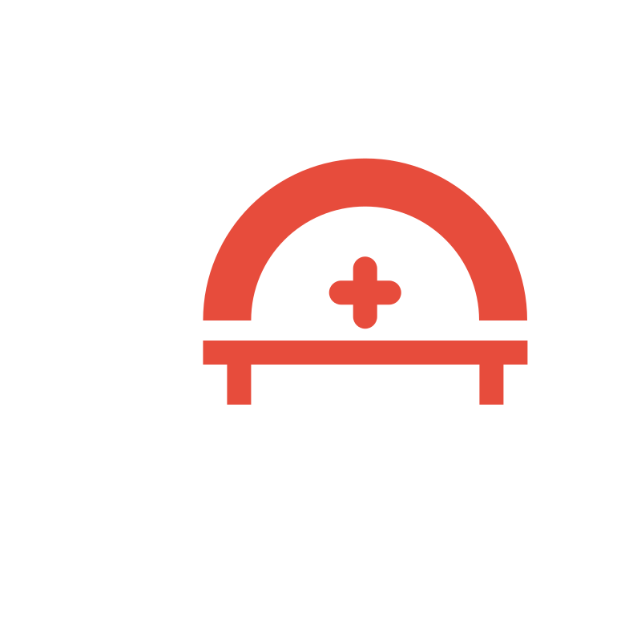

# ReachMed: Healthcare Access for Everyone

<p align="center">
  
</p>

<p align="center">
  <strong>Making healthcare guidance accessible to everyone, everywhere—even without an internet connection.</strong>
</p>

## 📱 About ReachMed

ReachMed is an innovative healthcare platform designed to bridge the gap between quality healthcare information and underserved communities. Founded in 2025 by Andrew Vong, a Computer Science student at Texas A&M University, ReachMed addresses a critical problem: traditional online health services don't reach people without stable internet access.

Our solution is a proprietary SMS-based messaging system that enables users to get medical help using basic mobile phones—no apps, no data, just accessible care through text.

## 🚀 Features

- **SMS-First Approach**: Works on any mobile phone with basic texting capabilities
- **Multilingual Support**: Available in English, Spanish, Vietnamese, and more
- **AI-Powered Triage**: Intelligent analysis of health concerns
- **Web Interface**: For users with internet access
- **Symptom Questionnaire**: Structured intake for better guidance
- **Direct Chat**: Free-form conversation with AI health assistant

## 🛠️ Tech Stack

- **Frontend**: React, Tailwind CSS, Framer Motion
- **UI Components**: shadcn/ui
- **Routing**: React Router
- **Styling Utilities**: tailwind-merge, clsx, class-variance-authority
- **Icons**: lucide-react
- **Build Tool**: Vite

## 🏗️ Project Structure

```
healthbridge-web/
├── public/              # Static assets
│   ├── reachmed-logo.svg
│   └── andrew-vong.jpg
├── src/                 # Source code
│   ├── components/      # React components
│   │   ├── layout/      # Layout components (Header, Footer)
│   │   ├── sections/    # Page sections (Hero, Features, FAQ, etc.)
│   │   ├── AboutPage.jsx # About page
│   │   ├── ChatBox.jsx  # Direct chat interface
│   │   ├── ChatPage.jsx # Chat page with dual modes
│   │   ├── HomePage.jsx # Landing page
│   │   └── IntakeForm.jsx # Health questionnaire
│   ├── App.jsx         # Main App component
│   ├── globals.css     # Global styles
│   └── main.jsx        # Entry point
└── package.json        # Dependencies and scripts
```

## 🚦 Getting Started

### Prerequisites

- Node.js (v16 or higher)
- npm or yarn

### Installation

1. Clone the repository
   ```bash
   git clone https://github.com/yourusername/healthbridge-web.git
   cd healthbridge-web
   ```

2. Install dependencies
   ```bash
   npm install
   # or
   yarn install
   ```

3. Start the development server
   ```bash
   npm run dev
   # or
   yarn dev
   ```

4. Open your browser and navigate to `http://localhost:5173`

## 📋 Pages

### Home Page
- Landing page with hero section, features, how it works, and FAQ
- Introduces visitors to ReachMed's mission and capabilities

### Chat Page
- Dual-mode interface:
  - **Direct Chat**: Free-form conversation with AI health assistant
  - **Symptom Questionnaire**: Structured health intake form
- Language selection (English, Spanish, Vietnamese)

### About Page
- Company mission and vision
- Problem statement and solution
- Founder information
- What sets ReachMed apart

## 🤝 Contributing

We welcome contributions to ReachMed! Please feel free to submit issues and pull requests.

1. Fork the repository
2. Create your feature branch (`git checkout -b feature/amazing-feature`)
3. Commit your changes (`git commit -m 'Add some amazing feature'`)
4. Push to the branch (`git push origin feature/amazing-feature`)
5. Open a Pull Request

## 📄 License

This project is licensed under the MIT License - see the LICENSE file for details.

## 📞 Contact

Andrew Vong - [andrewvong426@gmail.com](mailto:andrewvong426@gmail.com)


---

<p align="center">
  <strong>ReachMed</strong> - Healthcare for everyone, everywhere.
</p>
